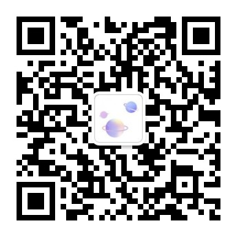
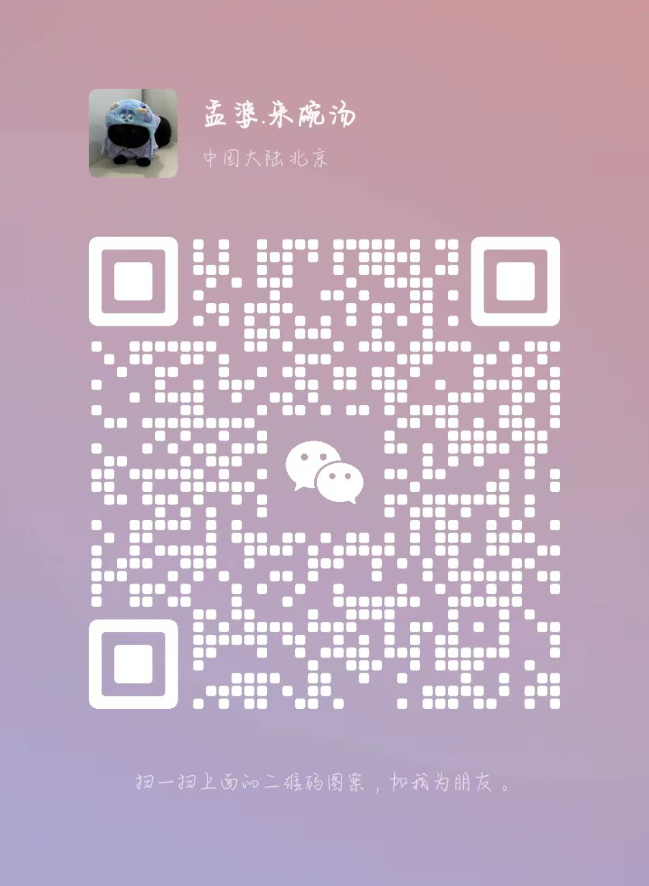
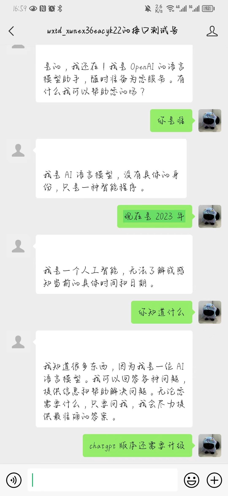
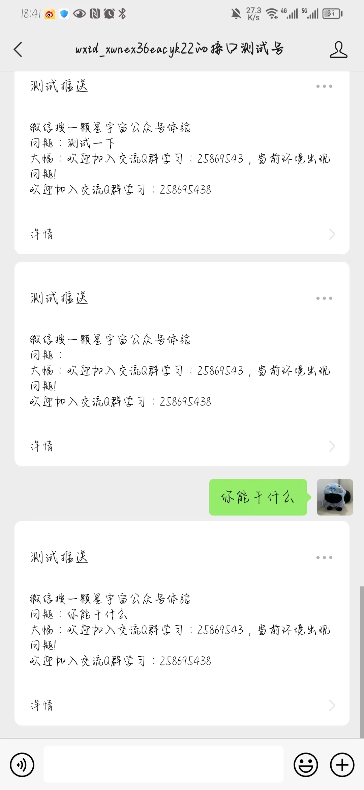

# 一颗星微信公众号

#### ChatGPT接入微信公众号，帮助公众号集成ChatGPT进行聊天对话智能机器人

### 微信公众号正式环境（扫码体验GPT）



### 扫码交流



## 效果截图



## 使用步骤：
1. 主要配置说明如下：
```
wx:
  mp:
    useRedis: false
    redisConfig:
      host: 127.0.0.1
      port: 6379
      timeout: 2000
    configs:
      - appId: 1111 # 第一个公众号的appid
        secret: 1111 # 公众号的appsecret
        token: 111 # 接口配置里的Token值
        aesKey: 111 # 接口配置里的EncodingAESKey值
      - appId: 2222 # 第二个公众号的appid，以下同上
        secret: 1111
        token: 111
        aesKey: 111

```
2. 运行Java程序：`WxMpDemoApplication`；
4. 配置微信公众号中的接口地址：http://公网可访问域名/wx/portal/xxxxx （注意，xxxxx为对应公众号的appid值）；
5. 根据自己需要修改各个handler的实现，加入自己的业务逻辑。

##### 鸣谢：[binarywang作者开源](https://gitee.com/binary/weixin-java-mp-demo-springboot/tree/master)

##### 功能欠缺
1. 如果网络情况，或者内容量比较大应该改为异步推送，否则会回复失败
2. 需要海外服务器，或者代理进行调用
3. 如需部署联系作者哦


